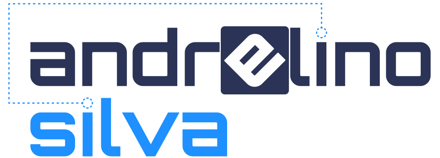

# Andrelino Silva

**Frontend Engineer · React / Next.js · TypeScript**

---

## 👨‍💻 Sobre Mim

Desenvolvedor de software com foco em **Frontend**, construindo aplicações web desde **2016**. Minha especialidade está no ecossistema moderno do React — de interfaces ricas até arquiteturas full-stack com Next.js.

Não me limito a "fazer funcionar": busco escrever código **limpo, testável e escalável**, aplicando ativamente princípios **SOLID, Clean Code** e separação de responsabilidades. Trabalho com Linux (Fedora) como ambiente principal e integro agentes de IA no fluxo de desenvolvimento para acelerar entregas sem abrir mão da qualidade.

> **Disponível para:** oportunidades remotas de Frontend, projetos freelance desafiadores e colaborações open-source.

---

## 🛠️ Stack Principal

> Ferramentas que uso diariamente para colocar produtos em produção.

### Frontend

### Backend & Infra

### Ferramentas

---

## 🚀 Projetos em Destaque

### [meBio](https://me.bio.br) — Plataforma de Agendamento & Link Aggregator
> SaaS multi-idioma com split de pagamentos, agendamentos e perfil personalizado para criadores de conteúdo e profissionais.

**Stack:** Next.js · TypeScript · Prisma · PostgreSQL · Stripe · i18n

---

### [Carangola Digital](https://carangoladigital.com.br) — Guia Digital Local
> Diretório de negócios com gestão própria pelos lojistas, foco em SEO local e cobertura de comércio, serviços e imóveis.

**Stack:** Next.js · TypeScript · Tailwind CSS · Firebase · SEO Avançado

---

### [Projeto RKW](https://landingpage-rkw.custoconecta.com.br) — Landing Page & Helpdesk Corporativo
> Sistema de atendimento e helpdesk interno desenvolvido para necessidades operacionais específicas de uma empresa.

**Stack:** Next.js · Node.js · Docker · PostgreSQL

---

### Hey Move *(em desenvolvimento)*
> App de produtividade que combina a técnica Pomodoro com monitoramento de exercícios físicos e dicas de saúde personalizadas.

**Stack:** React Native · TypeScript · Expo

---

## 📊 GitHub Stats

---

## 🌐 Idiomas

| Idioma | Nível |
|--------|-------|
| 🇧🇷 Português | Nativo |
| 🇺🇸 Inglês | Técnico — leitura e escrita fluente |
| 🇪🇸 Espanhol | Básico conversacional |

---

## ⚡ Além do Código

- 🤝 Aberto a **remote-first** e trabalho assíncrono
- 🐕 Esposa, dois cachorros e muito café ☕
- 🎵 Ouvindo música enquanto codifico
- 🙌 Trabalho voluntário nas horas vagas

---

*"Mesmo que o tempo seja curto e os desafios grandes, nunca desista de ser melhor do que você foi ontem."*

**— Andrelino Silva**

