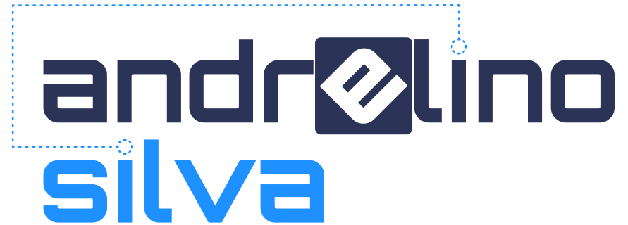

  

---

  

# :alien: Bio

 

# 🌱 O que estou aprendendo (techs)
- [React](https://pt-br.reactjs.org/)
- [React Native](https://reactnative.dev/) 
- [Node.js](https://nodejs.org/pt-br/) 
- [TypeScript](https://www.typescriptlang.org/pt/)

 

 

  

#
<h1>
🛠️ Linguagens e ferramentas: </h3>

       

  

# :rocket: Se estou a procura de trampo? Claro!
Estou ansioso por mudar de ramo. Atualmente trabalho com manutenção de celulares e estou tentando alinhar o máximo possível meu conhecimento/experiência para me tornar um integrante de qualquer empresa de tecnologia que queira me dar uma oportunidade para continuar meu sonho em ser um dev de sucesso. 

  

# 🌎 Bora conectar

 

  

